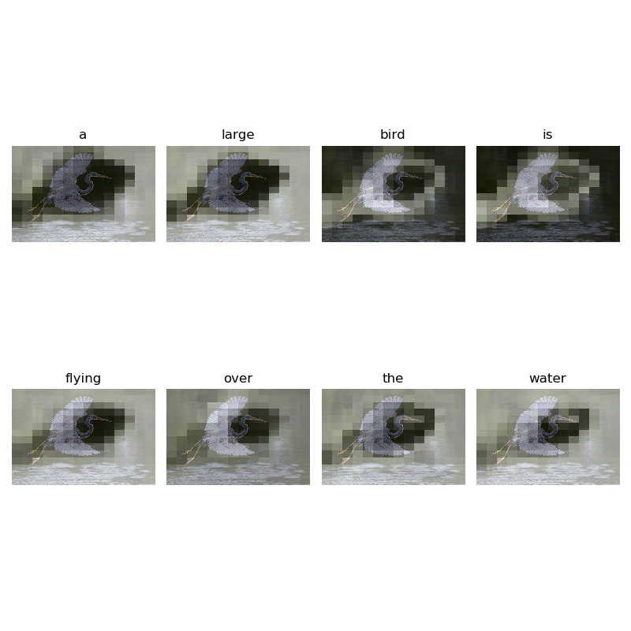
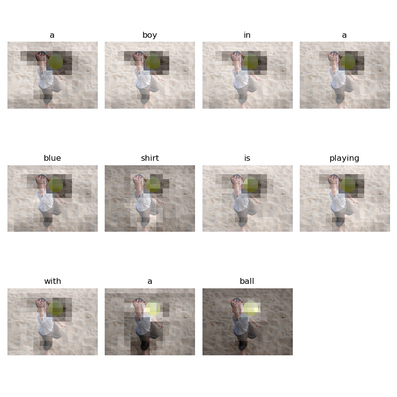
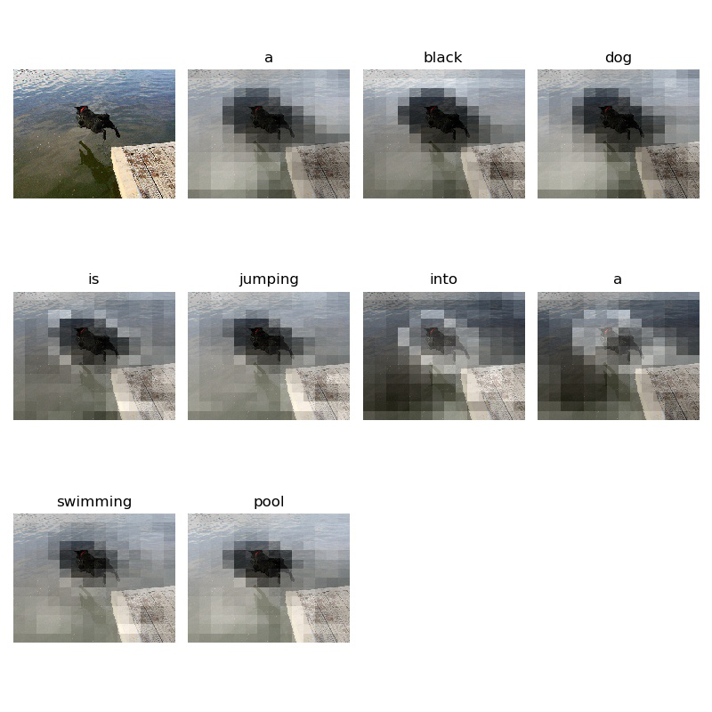

# Show, Attend and Tell 
Pytorch-lightning implementation of [Show, Attend and Tell: Neural Image Caption Generation with Visual Attention](http://arxiv.org/abs/1502.03044) which introduces visual attention mechanism and applies it to the image captioning task.

<br/>



<br/>


## References

Author's theano code: https://github.com/kelvinxu/arctic-captions 
yunjey's tensorflow implementation: https://github.com/yunjey/show-attend-and-tell  
Official tensorflow2 tutorial: https://www.tensorflow.org/tutorials/text/image_captioning

<br/>


## Getting Started

### Prerequisites

```bash
git clone https://github.com/kunhkim/show-attend-and-tell.pytorchlightning.git
pip install requirements.txt
```

This code is written in Python3.7 and requires [PyTorch](https://www.pytorch.org/), [pytorgh-lightning](https://github.com/PyTorchLightning/pytorch-lightning), and [nltk](https://www.nltk.org/). Ideally, these should be installed by above step.

### Download data 
Download [Flickr8k]() and Andrej Karparthy's [JSON blbo](https://cs.stanford.edu/people/karpathy/deepimagesent/) and locate JSON file to './data/'.

### Preprocessing
```bash
$ python utils/preprocess.py --json_path PATH/TO/JSON --img_path PATH/TO/FLICKR8K/IMAGE/PATH --extract True
```
By default, it will creates the preprocessed pickle files to './data/'.


<br>

### Train the model 
Before train the model create the checkpoint path as './checkpoint'.
Now, run the command bellow.

```bash
$ python train.py
```
Model will save the checkpoints at './checkpoint/RANDOMLYGENERATEDSTRING.ckpt'

<br>

### (optional) Tensorboard visualization

Pytorgh-lightning provids a tensorboard visualization for real-time debugging by default!!

```bash
$ tensorboard --logdir=./lightning_logs
```

<br>

### Evaluate the model 

To evaluate the model,

```bash
$ python eval.py --ckpt_path PATH/TO/CHECKPOINT
```

<br/>

## Results
 
<br/>

#### Training data

##### (1) Generated caption: A boy in a blue shirt is playing with a ball.


##### (2) Generated caption: A black dog is jumping into a swimming pool.


